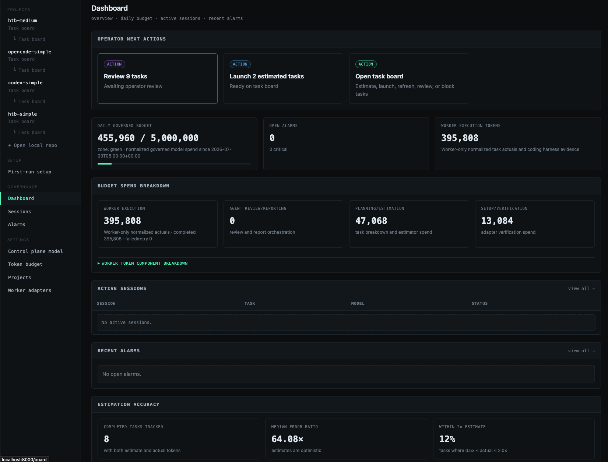
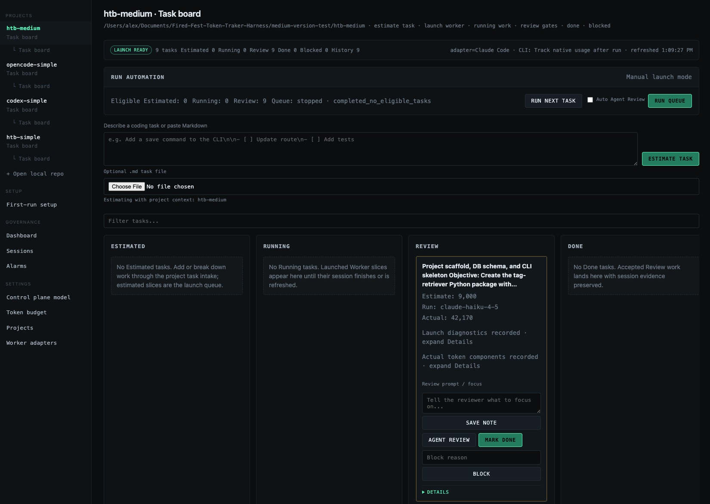
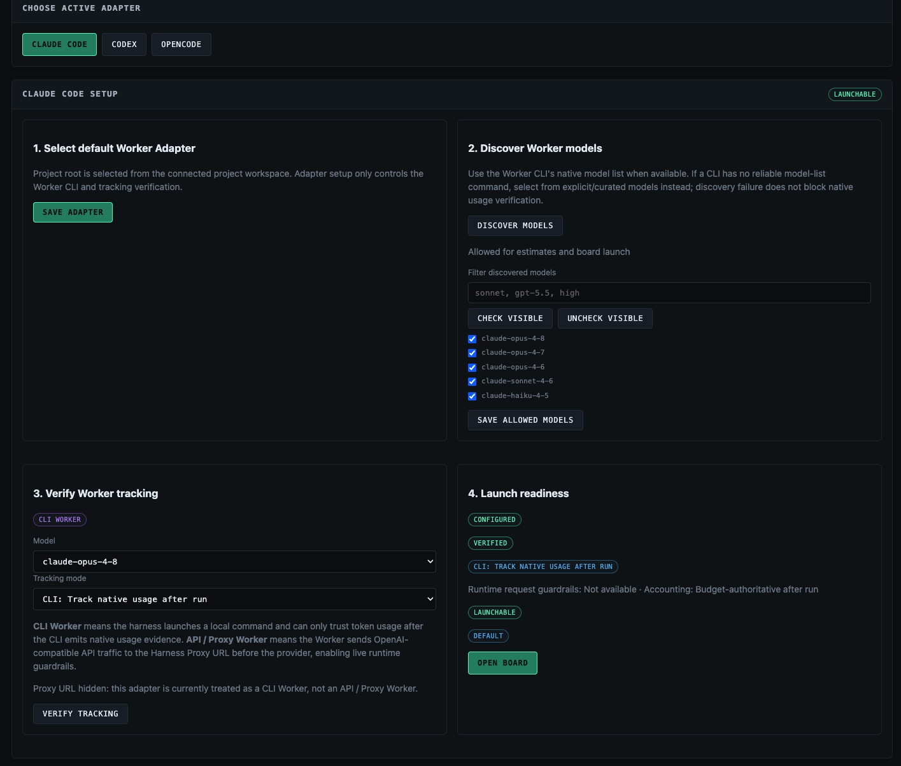
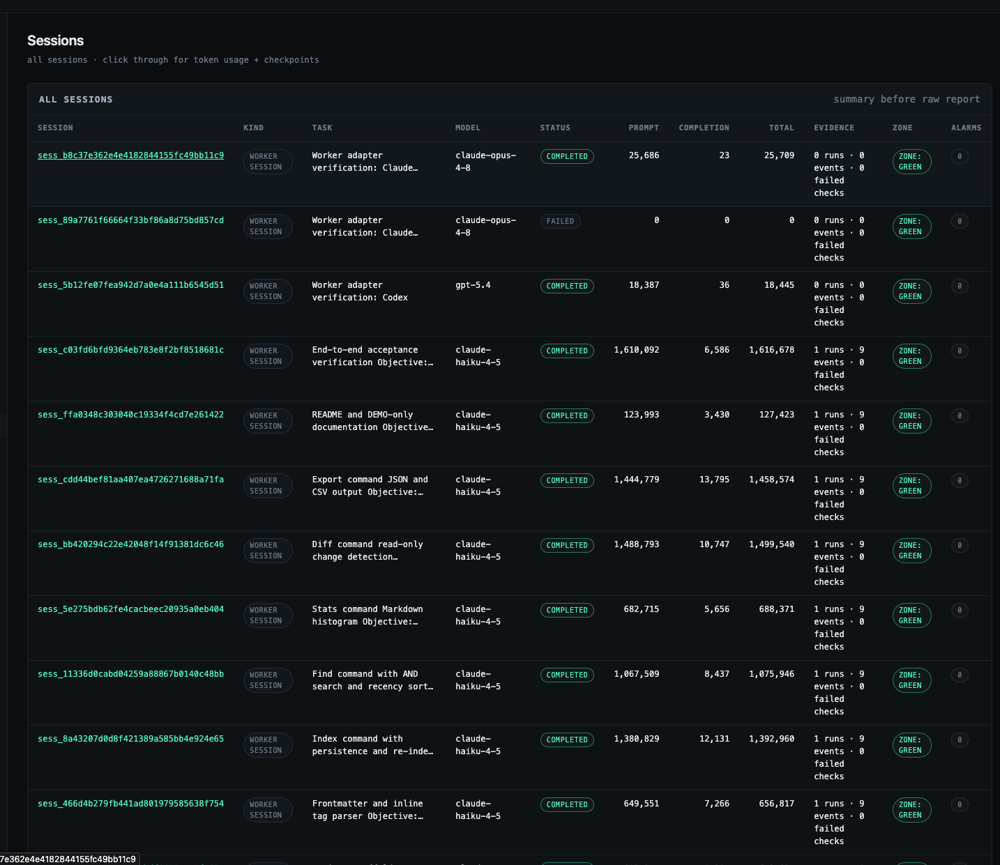

# AGILE-AI-HTB

AGILE-AI-HTB is a local, portal-first governance harness for AI coding agents.

It does **not** replace OpenCode, Claude Code, Codex, or another coding CLI. It wraps those tools with a board, budgets, launch checks, token evidence, session reports, and human review.

Use it when you want a coding agent workflow that is easier to inspect:

- estimate work before launch
- break larger plans into smaller governed slices
- run coding agents from a project board
- keep long-running agent work from turning into one polluted mega-thread: each slice gets its own scoped Worker run, while the Harness preserves the plan, budget, evidence, and review state
- record Worker Run evidence, stdout/stderr, token usage, and review state
- keep budget overrides and final acceptance in human hands

## Current supported path

Today the supported operator path is local all-in-one mode:

```text
installed htb CLI
  -> local Portal / Control Plane
  -> local repo connection
  -> verified local Worker CLI, such as OpenCode
  -> session report and token evidence
```

The Worker CLI keeps its own auth/config. AGILE-AI-HTB configures the control-plane model separately for estimates, planning, recommendations, summaries, and reports.

AGILE-AI-HTB only governs work launched through its own board and a verified Worker Adapter. It does not govern arbitrary external agent spend.

## Install

Recommended source install before PyPI release:

```bash
pipx install "git+https://github.com/alexdancer/AI-Harness-Token-Tracker.git"
cd /path/to/your/repo
htb init
htb serve
```

One-line bootstrap alternative:

```bash
curl -fsSL https://raw.githubusercontent.com/alexdancer/AI-Harness-Token-Tracker/main/install.sh | sh
htb init
htb serve
```

After the package is published to PyPI, the intended command is:

```bash
pipx install agile-ai-htb
htb init
htb serve
```

For contributors working from a checkout:

```bash
uv run htb init
uv run htb serve
```

More install detail: [docs/INSTALL.md](docs/INSTALL.md).

To update an existing install before PyPI release, rerun the curl installer or
`pipx install --force "git+https://github.com/alexdancer/AI-Harness-Token-Tracker.git"`.
This updates the global `htb` CLI and preserves repo-local `.htb/` state. See
[docs/INSTALL.md](docs/INSTALL.md#updating-agile-ai-htb).

## First run

1. Start the Portal:
```bash
 htb serve
```
2. Open `http://localhost:8000/`.
3. Open `/settings/control-plane`.
4. Pick a control-plane provider/model, paste the provider API key, save, then test the connection.
5. Connect a local repository from `/projects`.
6. Open `/settings/workers`, choose a Worker Adapter, discover/allow Worker models, then verify token tracking.
7. Launch a tiny task from the project board.
8. Review the session report and token evidence before marking the task done.

Default loopback `htb serve` opens the local Portal without a login token. If you bind the Portal to `0.0.0.0`, run it behind a proxy, or use Docker/shared access, keep the portal token from ignored `.htb/secrets.env` and sign in through `/login`.

For redacted support status:

```bash
htb check
```

## Portal UI

Representative local Portal screens using synthetic/public-safe data:










## How the workflow works

1. **Create a task** on the project board.
2. **Estimate** with the control-plane model.
3. **Launch** through a verified Worker Adapter.
4. **Run async** while the Portal stays responsive.
5. **Review evidence**: command plan, stdout/stderr, token usage, alarms, and session report.
6. **Accept or block** as the human operator.

Board states are:

```text
Estimated -> Running -> Review -> Done
                         -> Blocked
```

### With a Markdown file

For a larger `.md` plan, paste the Markdown into the board or upload the file instead of turning every bullet into a task yourself:

```text
.md plan
  -> Task Breakdown Agent applies the Task Slicing Policy
  -> you review the proposed AFK/HITL cards, proof, dependencies, and rejected non-tasks
  -> accepted cards are estimated and added to the board
  -> each card launches as its own scoped Worker run
  -> final Acceptance Verification checks the original Markdown contract
```

The Harness keeps the full source Markdown in the review record. Each Worker gets only the compact objective, boundaries, proof command, dependencies, likely entry points, and execution mode for its slice.

## Basic architecture

AGILE-AI-HTB has four main pieces:


| Piece                        | Role                                                                                                                                                                                     |
| ---------------------------- | ---------------------------------------------------------------------------------------------------------------------------------------------------------------------------------------- |
| **Portal / Control Plane**   | Browser UI and API for setup, estimates, project boards, launch, reports, budgets, and review.                                                                                           |
| **Local Runner**             | Runs near your local repository so Worker CLIs can see local files, git state, and their own credentials. In local mode it runs inside the same app process.                             |
| **Worker Adapter**           | Integration for a coding CLI such as OpenCode, Claude Code, or Codex. Adapter verification proves the CLI can run and produce trustworthy usage evidence for the selected model. |
| **Token ledger and reports** | SQLite-backed records for estimates, Worker Runs, token evidence, alarms, checkpoints, and session artifacts.                                                                            |


There are two model layers:


| Layer                   | Used for                                                      | Auth/config                                                     |
| ----------------------- | ------------------------------------------------------------- | --------------------------------------------------------------- |
| **Control Plane model** | estimates, planning, task breakdown, recommendations, reports | configured in `/settings/control-plane` or local config/secrets |
| **Worker model**        | the actual coding task                                        | configured by the native Worker CLI                             |


Pasting a control-plane API key does not configure OpenCode, Claude Code, Codex, or another Worker CLI.

## Local files and configuration

`htb init` creates local-only state under `.htb/`:

Run it from the repository you want AGILE-AI-HTB to govern. If you run it from a Git subdirectory, it initializes the Git repository root; outside Git, it initializes the current directory.

| File                   | Purpose                                                        |
| ---------------------- | -------------------------------------------------------------- |
| `.htb/config.toml`     | non-secret local config                                        |
| `.htb/secrets.env`     | ignored portal token and control-plane API key storage         |
| `.htb/guardrails.yaml` | ignored default guardrail config                               |
| `.htb/harness.db`      | default SQLite database, created or migrated by `htb init`     |


For normal local use, prefer the Portal settings screens. Environment variables are mainly for CI, headless runs, or compatibility.

Common environment variables:


| Variable                        | Purpose                                                                       |
| ------------------------------- | ----------------------------------------------------------------------------- |
| `TOKEN_TRACKER_PORTAL_TOKEN`    | Portal login token for shared/non-loopback access                             |
| `AGILE_AI_HTB_CONTROL_PROVIDER` | Control-plane provider, such as `openai`, `anthropic`, or `openai-compatible` |
| `AGILE_AI_HTB_CONTROL_MODEL`    | Control-plane model                                                           |
| `AGILE_AI_HTB_CONTROL_BASE_URL` | Base URL for OpenAI-compatible providers                                      |
| `AGILE_AI_HTB_CONTROL_API_KEY`  | Control-plane provider API key                                                |


The Portal writes submitted API keys only to ignored local secret storage and does not display raw key values again.

## Current limits

- The main supported path is local all-in-one mode.
- Worker launch readiness depends on local repo access, git state, installed Worker CLIs, and native CLI auth/config.
- Hosted workspaces, a fuller CLI, MCP access, and Homebrew install are future work.

## More docs

- [Getting started](docs/GETTING_STARTED.md)
- [Install options](docs/INSTALL.md)
- [Worker Adapter setup](docs/WORKER_ADAPTER_SETUP.md)
- [Setup support checklist](docs/SETUP_SUPPORT_CHECKLIST.md)
- [Contributing](CONTRIBUTING.md)
- [Changelog](CHANGELOG.md)
- [Project TODO](docs/TODO.md)

## Tests

```bash
uv run --extra test pytest -q
```

Focused contributor checks:

```bash
uv run htb --help
uv run --extra test pytest tests/portal tests/api tests/workers -q
uv run --extra test pytest tests/evals -v
```

Tests use fake LLM clients. They do not make provider calls.
