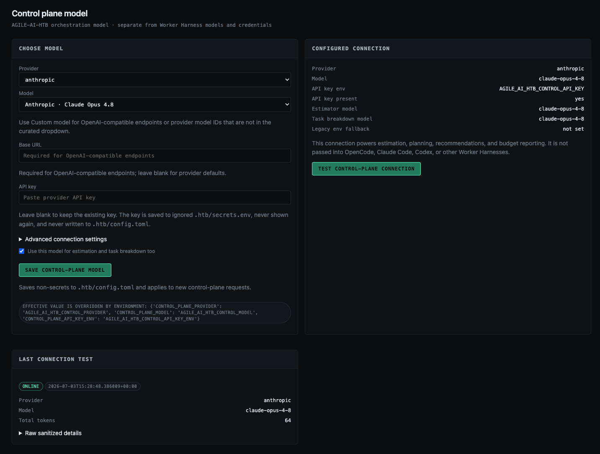
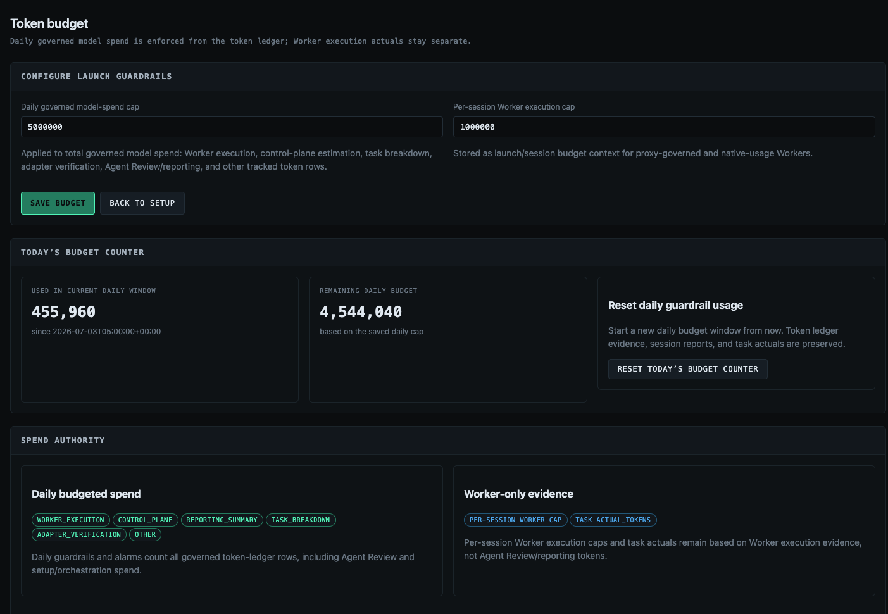
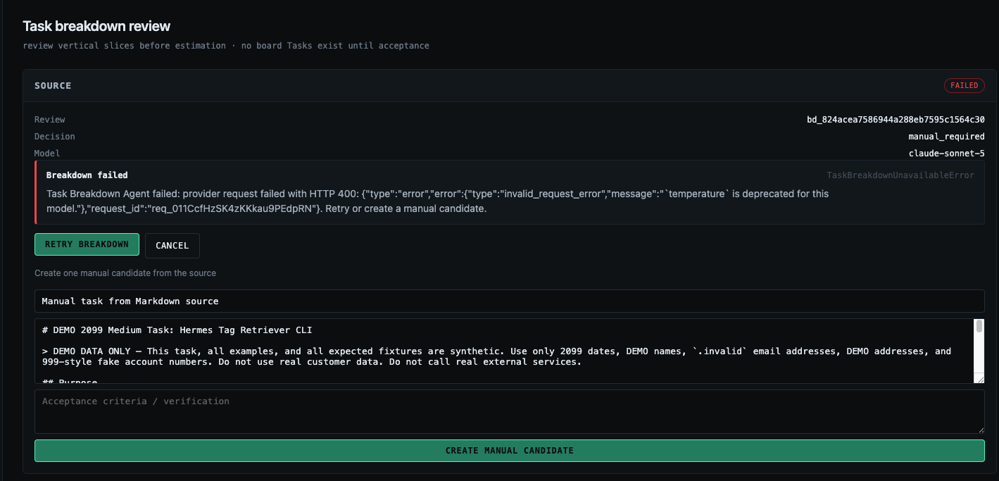

# Getting started

This is the first-run guide for operators evaluating AGILE-AI-HTB in their own workflow.

## First-run path

1. Install the operator CLI:
   ```bash
   pipx install "git+https://github.com/alexdancer/AI-Harness-Token-Tracker.git"
   ```
   After PyPI release, use `pipx install agile-ai-htb`. See [Install options](INSTALL.md) for the curl installer and Homebrew status.
2. Initialize and start:
   ```bash
   cd /path/to/your/repo
   htb init
   htb serve
   ```
   `htb init` keeps the installed CLI global but writes repo-local state under `.htb/`. Inside a Git repo, it targets the Git root even if you run it from a subdirectory; outside Git, it uses the current directory. It creates `.htb/config.toml`, `.htb/secrets.env`, `.htb/guardrails.yaml`, and `.htb/harness.db`.
3. Open `http://localhost:8000/`. The default loopback server does not require a portal login token.
4. Open `/settings/control-plane`, choose provider/model, paste the provider API key, save, then test the connection.
5. Connect a local repository from `/projects`.
6. Open `/settings/workers`, choose a Worker Adapter, discover/allow Worker models, then verify tracking.
7. Launch a tiny task from the project board and inspect the session report/token evidence.
8. Run `htb check` any time you need redacted setup status for support.

## Contributor checkout

If you are developing inside this repository rather than installing the operator CLI, use the repo-managed uv environment:

```bash
uv run pytest -q
uv run htb --help
```

`uv run htb ...` is a contributor convenience. The public operator path is an installed bare `htb` command.

## Model and credential split

AGILE-AI-HTB has two model layers:

| Layer | What it powers | Auth source |
|---|---|---|
| Control Plane / orchestrator model | Estimates, planning, task breakdown, model recommendations, summaries, reports | `/settings/control-plane`, ignored `.htb/secrets.env`, or env vars |
| Worker / coding harness models | The actual coding task launched through OpenCode, Claude Code, Codex, or another adapter | The native CLI's own auth/config |

Pasting a control-plane API key does not configure native Worker CLIs.

## What AGILE-AI-HTB governs

AGILE-AI-HTB governs launches that go through its board and verified Worker Adapter path:

- It estimates tasks before launch.
- It records budget and launch evidence.
- It enforces launch guardrails before new Worker runs.
- It imports trustworthy Worker usage evidence when available.
- It keeps human review as the final disposition step.

AGILE-AI-HTB cannot govern arbitrary external-agent token spend. The supported local path is governed only after Worker Adapter setup proves the native Worker CLI emits trustworthy, run-bound usage evidence that AGILE-AI-HTB can import for the selected model.

## Local secret storage

- `.htb/config.toml` stores non-secret config only.
- `.htb/secrets.env` is ignored local storage for the shared-access portal token and control-plane API key.
- The portal can write a submitted control-plane API key to `.htb/secrets.env` but never shows that raw value again.
- Blank API-key submissions preserve the existing key.
- Do not paste `.htb/secrets.env`, API keys, portal tokens, bearer tokens, or raw credentials into support issues.

## Docker and Local Runner limits

Docker runs the containerized Control Plane/Portal and persists SQLite state at `/data/harness.db`. Docker publishes the Portal beyond loopback, so token login remains enabled there; the no-secret path proves image build/start, `/health`, `/login`, and persistence with the synthetic default Docker token.

Docker does not automatically receive host-installed OpenCode, Claude Code, Codex, local repo paths, or host credentials. Real Worker launch readiness still depends on Worker Adapter setup and tracking-mode verification.

## Portal screenshots

Use synthetic/public-safe data only. Do not capture real secrets, real customer data, or private repo content.









