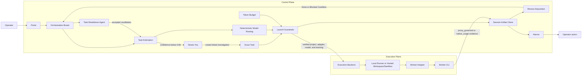

# Foreman AI HQ Harness

Foreman AI HQ is a harness for governing AI coding agents. It keeps long-running coding work organized as scoped tasks, proves which worker runs consumed which tokens, and gives the operator review points before and after execution.

The harness does **not** replace the coding agent. It wraps agents such as OpenCode, Claude Code, Codex, or a custom command with task intake, launch guardrails, budget tracking, evidence, alarms, and review.

## What the harness owns

- **Control Plane** — the Portal, Orchestration Board, setup flows, task breakdown, estimation, budget governance, token accounting, alarms, and reports.
- **Execution Plane** — the environment that can actually access a repository and launch a Worker Adapter. Today the proven local path is a Local Runner near the repo.
- **Worker Adapter** — the integration that configures, verifies, launches, and observes a local coding-agent CLI.
- **Session evidence** — persisted records for worker runs, token usage, launch metadata, stdout/stderr evidence, alarms, review decisions, and reports.

The Control Plane coordinates work. The Execution Plane does the work. Keeping those separate prevents the hosted product from claiming it can launch a user's local coding agent without a verified execution backend.

## Harness architecture



## Core flow

```text
User task or Markdown plan
        ↓
Task Breakdown Agent, when needed
        ↓
Operator reviews proposed vertical slices
        ↓
Task Estimation produces token estimate, complexity evidence, and risks
        ↓
Deterministic Model Routing selects or omits an adapter-compatible Worker model
        ↓
Orchestration Board shows Estimated tasks and launch readiness
        ↓
Launch Guardrails verify adapter, project, model, and token tracking
        ↓
Worker Adapter runs the coding agent in a scoped Worker Run
        ↓
Harness records usage, artifacts, alarms, and review evidence
        ↓
Operator reviews, marks Done, or Blocks with a reason
        ↓
Acceptance Verification proves the combined result when a plan was split
```

When automatic estimate confidence is below `0.60`, Needs You adds an advisory branch without changing the Task lifecycle or blocking launch by itself. The operator may acknowledge the estimate, replace it manually, or create one linked Scout for the current estimate revision. A completed Scout supplies bounded findings for a separately requested re-estimate; the canonical estimate changes only after an explicit Apply action succeeds.

## Control Plane and execution backends

The harness tracks project capability explicitly:

| Capability | Meaning |
|---|---|
| Not connected | No project context is available. |
| Analysis-ready | The harness can break down and estimate work, but cannot launch a Worker. |
| Launch-ready via Local Runner | A local runner has repo access and a verified Worker Adapter. |
| Launch-ready via Hosted Workspace/Sandbox | A hosted execution environment is sandboxed, configured, and verified. |
| Blocked | The project exists, but no backend satisfies launch requirements. |

The current operator path is local-first: `foremanctl init`, `foremanctl serve`, connect a local project, configure the control-plane model, verify a Worker Adapter, then launch from the project board.

Hosted workspaces are useful for analysis and estimation before they are launch-ready. Hosted Worker execution requires a verified sandbox, credentials policy, and Worker Adapter installation before it should be presented as launchable.

## Task intake and slicing

The board is not a backlog dump. Work enters through **Estimate task**:

- Short plain-text tasks may go straight to estimation.
- Markdown uploads, Markdown paste, and clearly oversized tasks go through the **Task Breakdown Agent** first.
- Breakdown is semantic, not bullet-count based.
- Proposed tasks should be narrow vertical slices that are independently grabbable, demoable or verifiable, dependency-aware, and small enough for one Worker run.
- Each proposed slice carries enough policy evidence to review it: objective, proof path, split/merge rationale, dependencies, likely entry points when known, and whether it is AFK-launchable or HITL.
- Constraints, non-goals, and verification notes are preserved as task metadata or rejected as non-tasks; they should not become fake implementation tasks.

Every Task has an explicit kind: `implementation`, `scout`, or `acceptance_verification`. The Task Breakdown Agent proposes a Scout only when a concrete unanswered repository question materially prevents an honest estimate or executable slice. The candidate must name the question, inspection boundary, expected findings, and proof path; generic research and ordinary implementation-time inspection stay out of separate Scout cards.

For integrated work, the breakdown should include a final **Acceptance Verification** task. That task checks the combined result against the original source contract instead of rerunning the whole implementation as one large task.

## Orchestration Board lifecycle

The canonical task states are:

| State | Meaning |
|---|---|
| Estimated | The task has an estimate and any adapter-compatible routed Worker model evidence, and can be launched once guardrails pass. |
| Running | A Worker Run is active. |
| Review | The Worker Run ended and needs operator disposition. |
| Done | The operator accepted the result. |

Blocked is a condition, not a lifecycle state or board column. A Task that cannot proceed stays in its canonical position with a bounded Blocked Condition reason. For example, a failed estimate remains on the Pipeline with manual-estimate recovery, while a review Block disposition remains in **Review**. An Estimated Task with no verified Worker Adapter likewise stays **Estimated** with launch guardrail failures shown.

Review is human-owned. Agent Review can provide advisory findings, but it does not automatically mark work Done, add or clear a Blocked Condition, or create repair work.

## Worker Adapters and tracking modes

A Worker Adapter is launchable only after setup verification proves budget-authoritative token tracking.

| Tracking mode | What it proves | Runtime request governance | Board launch |
|---|---|---|---|
| `proxy_governed` | Worker model traffic flows through the Harness Proxy and token rows are recorded directly. | Available while calls pass through the proxy. | Launchable when verified. |
| `native_usage` | The CLI emits trustworthy usage evidence bound to the Worker Run. | Not available mid-run; usage is reconciled after completion. | Launchable when verified. |
| `observed_only` | The harness can observe process/log output only. | Not available. | Diagnostic only; not launchable for governed board tasks. |

The first verified local path is OpenCode through native usage import. Claude Code, Codex, and custom commands may appear as adapter presets, but Launch Guardrails keep them non-launchable until verification proves authoritative tracking in the current environment.

`proxy_governed` is a real architecture path for proxy-capable adapters, but it should not be presented as the default local proof unless a stock adapter is verified end-to-end through the proxy.

Read-only capability is separate from tracking authority. A verified `native_usage` or `proxy_governed` adapter may launch compatible implementation Tasks without having an adapter-enforced read-only profile. Scout launch requires both. The current built-in Scout-compatible profile is Codex with its native `--sandbox read-only` enforcement; `observed_only` remains non-launchable regardless of read-only command support.

## Launch guardrails

Before a task can move from **Estimated** to **Running**, the harness checks:

- a Worker Adapter is configured;
- token tracking is verified through `proxy_governed` or trustworthy `native_usage` evidence;
- the working directory and project profile are valid;
- the selected model is allowed and compatible with the adapter;
- any required session-key or proxy wiring exists;
- budget override acknowledgement is recorded when the estimate exceeds remaining budget.
- for a Scout, the selected adapter has a verified adapter-enforced read-only profile.

Write-capable sessions also require a clean git working tree before launch. The harness creates the task branch, lets the Worker edit there, and owns the final commit only after configured verification passes. Read-only inspection sessions may run against a dirty repo.

Canonical Task kind forces every Scout into read-only launch mode server-side, regardless of client input or stale metadata. Scouts never receive a Task branch or Harness-owned commit. Before/after repository checks remain audit and defense evidence, but they do not replace pre-execution adapter enforcement; any detected Scout mutation records a hard safety Blocked Condition with preserved run evidence.

Operational launch failures such as CLI timeout, nonzero exit, or missing usage evidence return the Task to **Estimated** with sanitized launch-error evidence so it can be retried. Hard safety or workflow failures preserve the canonical lifecycle state and record a Blocked Condition with evidence.

## Budgets, guardrails, and alarms

The harness tracks both:

- **Orchestration tokens** — task breakdown, estimation, adapter verification, review, and reporting.
- **Worker tokens** — the coding-agent run itself.

Both count against the daily budget, but they are labeled separately so operator overhead does not distort task execution actuals.

Scout usage is Worker spend attached to the Scout Task, not hidden orchestration spend. It is excluded from implementation estimate-accuracy aggregates and coefficient fitting, and Scout calibration examples do not cross-calibrate implementation Tasks solely because their text overlaps.

Budget governance is soft by design. Over-budget launches require explicit operator override and audit evidence; non-budget Launch Guardrail failures such as unverified tracking, invalid project setup, disallowed models, or missing required wiring remain non-launchable. The harness records overruns, raises alarms, and preserves evidence. It does not silently kill a running native-usage Worker mid-task.

Common alarm classes include budget zone changes, daily cap exceeded, session timeout, repeated-loop detection, tool-category bias, and checkpoint failure. Alarms are structured records with context and recommended action; the operator decides whether to continue, abort, raise budget, or adjust guardrails.

## Session artifacts and review evidence

Each Worker Run preserves enough evidence to review and audit the run later:

- task, project, adapter, model, tracking mode, and launch metadata;
- token usage with fresh/cache/output/cost breakdown when available;
- stdout/stderr or native usage evidence, redacted where needed;
- branch, diff summary, verification command, and commit metadata for write-capable work;
- alarms, failures, review prompts, Agent Review output, and operator disposition.
- for Scouts, the enforced read-only profile plus bounded findings, risks, recommendation, and unchanged-repository evidence.

The Session Artifact is the replayable record. Checkpoints and reports should be derived from this evidence rather than from unverified prose.

## Run automation boundary

The board may run eligible Estimated tasks one at a time for a project. Queue automation uses the same Launch Guardrails and Worker Run lifecycle as manual launch.

It does not auto-approve budget overrides, auto-mark tasks Done, run cross-project autopilot, or create repair tasks from failure text. Auto Agent Review, when enabled, only stores advisory review evidence; the operator still makes the final disposition.

## Operator surfaces

- **Portal** — primary user experience for setup, project connection, Orchestration Board, dashboard, alarms, review, and reports.
- **Needs You** — project-scoped decisions and advisory low-confidence estimate work, with backend-authoritative recovery actions.
- **`foremanctl` command** — administrative entrypoint for initialization, serving, checks, and demo setup.
- **Settings** — source of truth for control-plane model connection, Worker Adapter setup, token budget, and project readiness.
- **REST API** — backing API for sessions, tasks, guardrails, alarms, dashboard data, and reports.

Secrets are local and ignored. Operator config stores non-secret settings; provider keys, portal tokens, and CLI auth must not appear in support output, logs, or committed files.

## Current stack

| Layer | Technology |
|---|---|
| Runtime | Python 3.11+ |
| Web/API | FastAPI |
| UI | React/Vite Portal shell built by FastAPI; server-rendered login and missing-build recovery only |
| Storage | SQLite |
| Packaging | `foremanctl` CLI, `uv`, Docker packaging support |

For exact product vocabulary, use `CONTEXT.md` as the source of truth. For operator setup, use `README.md`, `docs/GETTING_STARTED.md`, `docs/INSTALL.md`, and `docs/WORKER_ADAPTER_SETUP.md`.
